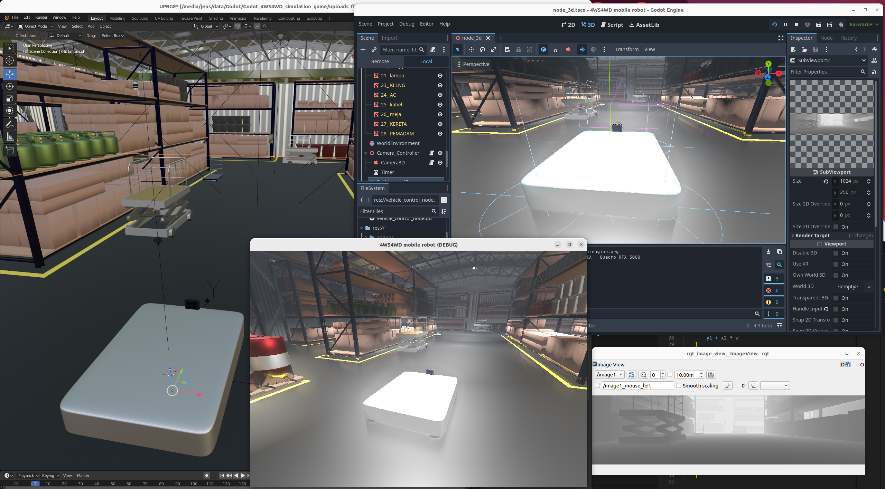

# Godot-ROS2 Integration repository

This project aims to fuse the powerful open-source game engine Godot 4 with ROS2 (Robot Operating System) framework. Leveraging Godot's modular C++ source code, this integration fits seamlessly into the ROS2 pipeline, providing a supreme platform for developing and testing robotics algorithms in simulated environments.




## This repository contains:

- A ROS2 component developed as a Godot module, built with the Godot 4 source code. Godot uses SCons build system.
- An example simulation of a mobile robot, created as a Godot 4.3 game.

The example simulation features a **4WS4WD** (4-Wheel Steering, 4-Wheel Driving) setup, where each wheel is configured as a **Swerve Drive**. The robot can be controlled externally via ROS2 and includes a simulated Depth Camera that interfaces with ROS2 for image data.

## Background

### Godot 4.3

Godot 4.3 is the latest iteration of the Godot game engine, known for its open-source nature, modular architecture, and robust community support. Compared to other popular game engines like Unity and Unreal, Godot stands out due to its lightweight footprint, ease of use, and complete access to its source code. These features make it particularly suitable for integration with other open-source projects, such as ROS2.

Godot's architecture is highly modular, allowing developers to extend or modify its functionality through modules. In the context of ROS2, this modularity enables tight integration with ROS2's middleware, making it possible to run complex simulations and control systems entirely within the Godot environment.

### 4WS4WD Mobile Robot Setup

The 4WS4WD (4-Wheel Steering, 4-Wheel Driving) configuration is an advanced mobile robot setup where each wheel is independently steered and driven, commonly referred to as a **Swerve Drive**. This setup allows for highly maneuverable robots capable of moving in any direction, regardless of their orientation, making them ideal for complex navigation tasks.

Swerve Drive robots are often used in competitive robotics, such as the FIRST Robotics Competition (FRC). The ability to control each wheel's steering angle and speed independently provides unparalleled maneuverability, allowing the robot to rotate on the spot, move sideways, or follow complex paths with precision.

For more information on the 4WS4WD Swerve Drive configuration, consider reviewing the following references:

- [4-Wheel Independent Drive, Independent Steering (Swerve)](https://www.chiefdelphi.com/t/paper-4-wheel-independent-drive-independent-steering-swerve/107383)
- [Swerve Drive Kinematics](https://first.wpi.edu/wpilib/allwpilib/docs/release/java/src-html/edu/wpi/first/math/kinematics/SwerveDriveKinematics.html)
- [Swerve Drive Visualization](https://github.com/xiaoxiae/SwerveDriveVisualisation)

### Jolt Physics Engine

While Godot 4 comes with a built-in physics engine, it has been noted that this default engine may not meet the high precision and performance requirements needed for advanced robotics simulations. To address this, this project uses the **Jolt Physics Engine**, a native extension for Godot that provides a more robust and accurate physics simulation environment.

Jolt is known for its high performance and stability, making it well-suited for simulations involving complex physical interactions. With Jolt, Godot 4 handles 3D physics simulations "like a charm," offering a much-needed improvement over the default engine.

For more details on the Jolt Physics Engine and its integration with Godot, refer to the following resources:

- [Jolt Physics Engine for Godot](https://github.com/godot-jolt/godot-jolt)
- [Discussion on Godot 4's Default Physics Engine](https://www.reddit.com/r/godot/comments/16p90a1/godot_4_default_physics_engine_is_a_complete_mess/)

## Features

- **Godot Module for ROS2**: Seamlessly integrate Godot 4 with ROS2 for advanced robotics simulations.
- **Mobile Robot Simulation**: A comprehensive example featuring a 4WS4WD mobile robot with 8 DOF.
- **Jolt Physics Engine**: Utilizes the Jolt Physics Engine for enhanced simulation accuracy and stability.
- **ROS2 Interface**: Control the robot and receive data from a simulated Depth Camera through ROS2.

## Installation

### Prerequisites

- Godot 4.3
- ROS2 (Humble Hawksbill or later)
- Jolt Physics Engine (for Godot)
- rqt_image_view ROS2 add-on

### Building the Godot Module

1. Clone the repository:
   ```bash
   git clone https://github.com/nordstream3/Godot-4-ROS2-integration.git

2. Unzip compressed .blend file:
   ```bash
   cd /path/to/Godot-4-ROS2-integration/src/Godot_4WS4WD_simulation_game
   unzip warehouse.blend.zip

3. Build Godot 4.x with ROS2-module:
   ```bash
   cd /path/to/godot-source-code
   scons -j8 verbose=yes disable_exceptions=false SHOWBUILD=1 custom_modules=/path/to/Godot-4-ROS2-integration/src/godot_custom_modules platform=linuxbsd
4. Build Jolt Physics Engine add-on for Godot 4 ([details are here](https://github.com/godot-jolt/godot-jolt)):
   ```bash
   git clone https://github.com/godot-jolt/godot-jolt.git
   cd godot-jolt
   cmake --preset linux-gcc-x64
   cmake --build --preset linux-gcc-x64-distribution
   cmake --build --preset linux-gcc-x64-editor-distribution
   cmake --install build/linux-gcc-x64 --config Distribution --prefix /path/to/Godot-4-ROS2-integration/src/Godot_4WS4WD_simulation_game
   cmake --install build/linux-gcc-x64 --config EditorDistribution --prefix /path/to/Godot-4-ROS2-integration/src/Godot_4WS4WD_simulation_game
   
## Usage
### Running ROS2 integrated 4WS4WD Mobile Robot Simulation (Game)
1. Source ROS2:
   ```bash
   source /path/to/ros2_humble/install/local_setup.bash
2. Run Godot in verbose/debug_info mode:
   ```bash
   ./godot.linuxbsd.editor.x86_64 -v -d
3. Open Godot_4WS4WD_simulation_game and hit the play button to run the game.
4. In a new terminal, subscribe to ROS2 image nodes using "rqt_image_view":
   ```bash
   source /path/to/ros2_humble/install/local_setup.bash
   ros2 run rqt_image_view rqt_image_view

## License
This project is licensed under the MIT License.
